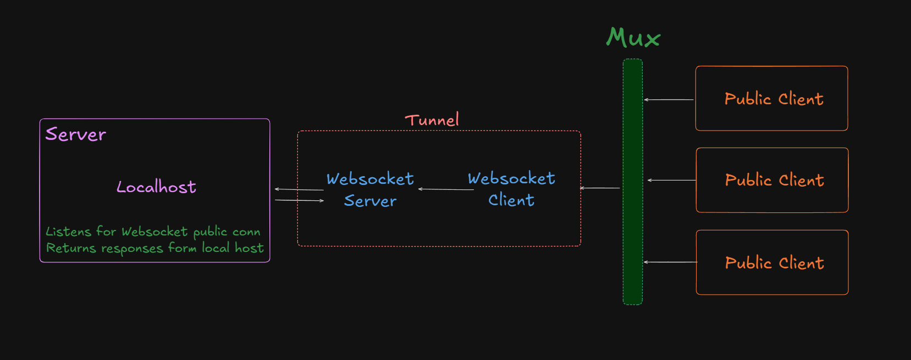

# Luminet



- Implement a basic TCP server in Go to listen for incoming connections.
- Implement a TCP client to connect to the local server.
- Forward traffic between the remote client and the local server.
- Implement an HTTP server to handle incoming HTTP requests.
- Forward HTTP requests to the local server and return responses to the remote client.
- Add WebSocket support using a library like gorilla/websocket.
- Design a protocol for communication between the client and server (e.g., JSON over WebSocket or raw TCP).
- Implement authentication (e.g., API keys or tokens) to secure the connection.
- Add heartbeat/ping-pong mechanism to keep connections alive.
- Implement subdomain allocation for public endpoints (e.g., user123.jprq.io).
- Use a DNS library or API to dynamically create subdomains.
- Map subdomains to specific tunnels.
- Add TLS/SSL support to secure traffic between the client and server.
- Implement rate limiting to prevent abuse.
- Add logging and monitoring to detect suspicious activity.
- Write unit tests for core functionality (e.g., tunneling, HTTP forwarding).
- Write integration tests to test the client-server interaction.
- Test edge cases (e.g., high traffic, connection drops).
- Containerize the project using Docker.
- Deploy the server to a cloud platform (e.g., AWS, GCP, or Heroku).
``` Plain Text
            Public Client
                 │
                 ▼
        🌍 Public Internet
                 │
                 ▼
        🌐 Tunneling Server
            - Listens for public connections
            - Forwards data between phone & local server
                 │
                 ▼
        🏠 Local Network
                 │
                 ▼
        📞 Local TCP Server
            - Listens on port 8000
            - Receives & responds to messages
```
1. Set up the TCP Server to listen for incoming connections. ✅
2. Create a TCP Client that connects to the server. ✅
3. Implement Message Forwarding between the client and server. ✅
4. Allow multiple clients to connect simultaneously and handle multiple streams over a single TCP connection.
``` Plain Text
      
      Client1 ────┐
                  │
      Client2 ────┼───> [Multiplexing Server (Using Websocket)] ───> Local Service
                  │
      Client3 ────┘

1️⃣ Create a WebSocket server that listens for connections.
2️⃣ Create a WebSocket client that connects to the server.
3️⃣ Send and receive messages over WebSockets.

✔ Reduces Connection Overhead → A single WebSocket can handle multiple logical channels.
✔ Efficient Resource Usage → No need to open/close WebSockets for each interaction.
✔ Supports Multiple Clients & Services → Handle multiple user sessions over one WebSocket.

✅ A way to generate stream_id for each client request.
✅ A message router that keeps track of each request’s stream_id.
✅ A mechanism to match responses to the correct client using stream_id.

```
1. Forward HTTP requests from the remote client to the local server.
2. Add WebSocket support for bidirectional communication.
3. Design a communication protocol (e.g., JSON over WebSockets).
4. Implement subdomain allocation (e.g., user123.jprq.io).
5. Use a DNS library or API to dynamically create subdomains.
6. Map subdomains to specific tunnels.
   
7. Add heartbeat (ping-pong mechanism) to keep connections alive.
8. Add TLS/SSL support for secure traffic.
9.  Implement authentication using API keys or tokens.
10. Add logging & monitoring for suspicious activity.
11. Write unit tests for core functionalities.
12. Implement rate limiting to prevent abuse.
13. Containerize the project using Docker.
14. Deploy to AWS/GCP/Heroku.